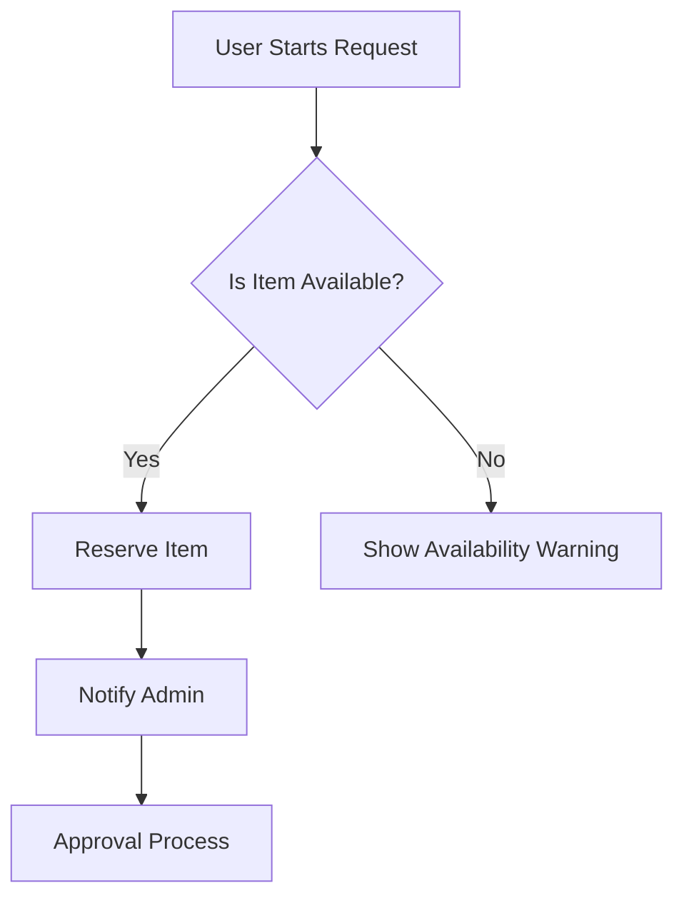

# Product Requirements Document (PRD) Skill

This skill provides a structured approach to creating high-quality Product Requirements Documents (PRDs). It ensures that all necessary aspects of a feature or product are considered and clearly communicated.

## PRD Template Structure

A good PRD should include the following sections:

### 1. Header
- **Project Name**: [Name]
- **Status**: [Draft/In Review/Approved/Implementing]
- **Owner**: [Your Name/Role]
- **Stakeholders**: [List of key people involved]
- **Timeline**: [Target completion/milestones]

### 2. Goal & Context
- **Problem Statement**: What problem are we solving? Why does this matter?
- **Goals**: What are the high-level objectives?
- **Non-Goals**: What is explicitly out of scope?
- **Target Audience**: Who is this for?

### 3. User Stories
- Use the format: "As a [user], I want to [action], so that [benefit]."
- Prioritize stories (Must-have, Should-have, Nice-to-have).

### 4. Functional Requirements
- Detailed list of features and functionality.
- Logic, rules, and edge cases.
- Use Mermaid diagrams if the flow is complex.

### 5. Technical Considerations
- **Architecture**: How does this fit into the existing system?
- **Data Model**: Any changes to the database?
- **Security & Privacy**: PI handling, auth requirements.
- **Performance**: Latency, scale requirements.

### 6. Design & UI/UX
- Links to mockups or wireframes.
- Key UX principles (e.g., "Must be optimized for mobile first").
- Design tokens or component usage.

### 7. Success Metrics
- How will we know if this is successful? (KPIs, engagement metrics).
- Analytics tracking requirements.

### 8. Risks & Dependencies
- What could go wrong?
- What are we waiting on (external APIs, other teams)?

## PRD Writing Guidelines

- **Be Concise**: Use bullet points and clear, direct language.
- **Use Visuals**: Embed diagrams or screenshots wherever possible.
- **Focus on 'Why' & 'What'**: Leave the 'How' (implementation details) to the technical design doc unless relevant to requirements.
- **Iterate**: PRDs are living documents. Update them as requirements evolve.

## Mermaid Workflow Example

